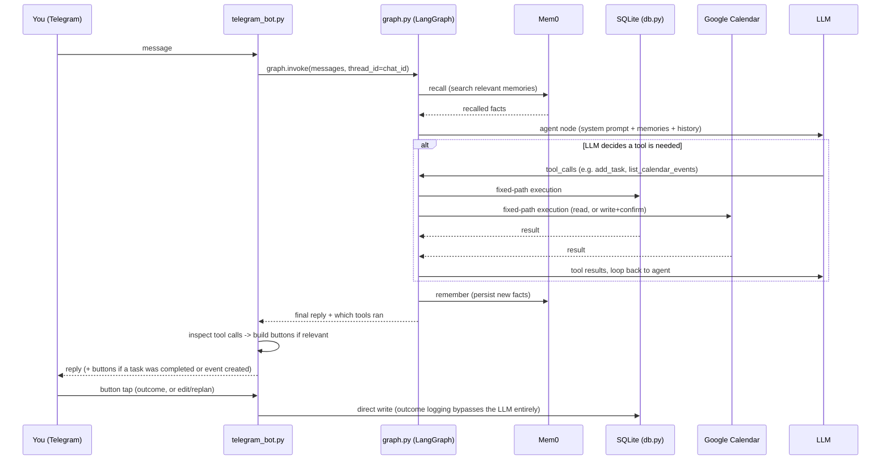

# Architecture

This is the honest, end-to-end account of how Jarvis actually works right now, and how that maps against the original 10-component plan. Where I'm not certain my interpretation matches the intended vision, I've said so explicitly rather than quietly picking an answer.

## End-to-end flow

Two things worth being explicit about in this flow:

- **The agent↔tools loop is real, not narrated.** When the model decides to check your tasks or add a calendar event, that's an actual function call against SQLite or the Calendar API (`tools.py`, `calendar_tools.py`), routed through LangGraph's `ToolNode` + `tools_condition`. The LLM's job is deciding *when* to call something and *how* to reason about the result — not describing an action in prose instead of taking it.
- **Recall and remember are unconditional, not judgment calls.** Every turn does a Mem0 search before the agent responds and a Mem0 write after — no LLM decides whether to bother. What *is* a judgment call is which tools to invoke and how to weigh what comes back.

## Component status against the plan

| # | Component | Status | Where |
|---|---|---|---|
| 4.1 | Telegram interface | **Done** | `telegram_bot.py` |
| 4.2 | Structured data model (goals/tasks/routines) | **Done** | `db.py`, `tools.py` |
| 4.3 | Google Calendar | **Done** (reads + writes) | `calendar_service.py`, `calendar_tools.py` |
| 4.4 | Digital wellbeing ingestion | **Not started** | Needs the bot to become an HTTP server + Tasker/MacroDroid on your phone + a tunnel or the VPS from §6 |
| 4.5 | Safety gate | **Stopgap only** | Calendar writes use a `confirm: bool` two-step (propose → explicit yes → execute), not the safe/ambiguous/dangerous classifier your plan describes |
| 4.6 | Proactive nudge engine | **Not started** | Needs 4.4 (real usage signal) and a scheduled job; task-outcome logging (below) is a first, small step toward the data it would read |
| 4.7 | Adaptive replanning | **Partial, reactive only** | The pushback/scheduling reasoning in the system prompt handles this *within* a conversation; there's no standalone "something changed, replan my day" flow yet |
| 4.8 | Long/short-term prioritization | **Partial, prompt-level** | A priority lean (academics > energy/self-care > social/fun) lives in the system prompt; the "editable goals file" the plan describes is really the `goals` table now, not a separate file |
| 4.9 | Blockchain RAG subgraph | **Not started** | Explicitly out of scope for v1 in your own plan; independent track |
| 4.10 | Twilio calling | **Not started** | Explicitly deferred until the safety gate has a track record |

## What's actually enforced vs. what's just prompted

Worth being precise about the difference, since it matters for trust:

- **Enforced in code, not just asked nicely for:** the confirm-gate on calendar writes (`calendar_tools.py` — a write tool literally cannot execute without a prior `confirm=false` call having happened in the conversation), the recall/remember steps running every turn, tool-call detection for buttons reading actual tool-call data rather than guessing from reply text.
- **Prompt-level (the model can, in principle, get wrong):** the pushback/negotiation behavior, the fixed-vs-self-directed distinction, physical-reality/sleep-gap reasoning, the priority lean, energy-pattern noticing via Mem0 recall. These have all been tested against real scenarios and worked correctly, but they're judgment the model applies, not a hard constraint — that's the right trade-off for genuinely fuzzy calls (is this trade-off actually close?), but it means they can occasionally miss in a way code-level enforcement can't.

## Task-outcome logging (the start of the pattern-mining work)

`tasks` now has `completed_at` (set automatically) and `outcome` (set only via a Telegram button tap — `focused` / `okay` / `distracted` / `blocked`, chosen because focus quality is the actual signal worth correlating against what preceded a task, not a generic sentiment score). This data has nowhere to go yet — there's no reflection step reading it — but it starts accumulating from today instead of from whenever 4.6 gets built.

## Open question — where I'm not fully certain of the intended vision

The plan (and later conversation) both describe an assistant that's **autonomy-supportive**: it pushes back, asks rather than asserts, and treats the final call as the user's ("the call is theirs to make... your job is to make sure they're making it with eyes open"). Later in the same conversation, a stronger framing came up — the assistant should take ownership of outcomes, and a failure to follow through should be read as the assistant having nudged or planned poorly, not just a user lapse.

The interpretation currently built favors the first framing for anything touching an actual decision (the agent still asks, still defers), while adopting the second framing for how the *system itself* should improve over time (getting better at timing/phrasing nudges, catching its own planning misses) — not as license to be directive about what you should do in the moment. If that's not the right split, this is the place to say so before the nudge engine gets built on top of it.
